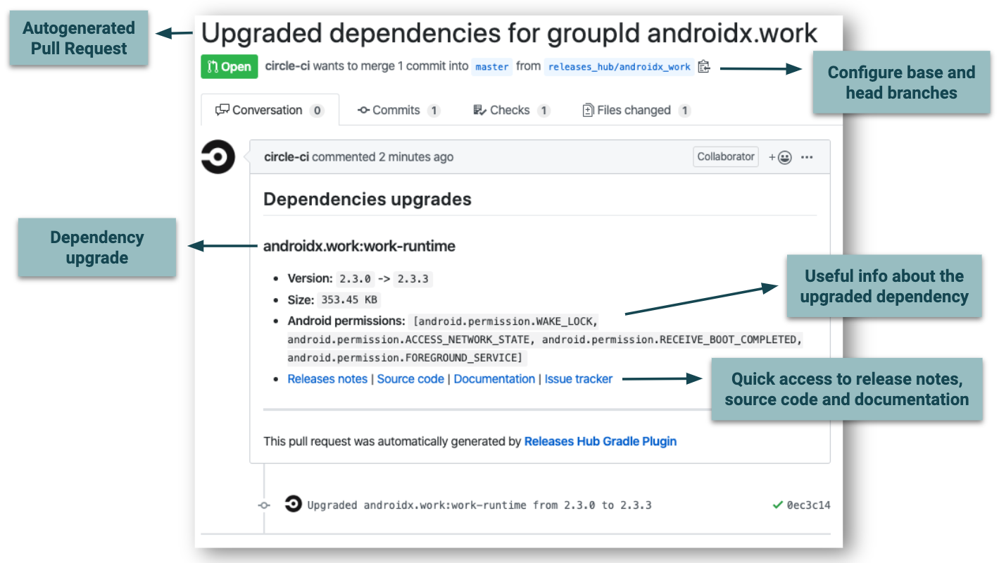

# Releases Hub Gradle Plugin
Gradle Plugin to automatically upgrade your java gradle project dependencies and send a GitHub pull request with the changes

## How it works

1. Apply and configure the plugin according to your needs
2. Invoke it on your CI tool (daily, weekly, monthly, as you wish)
3. If any of your dependencies are out-of-date, the plugin opens pull requests to update them.
4. You verify that your CI checks pass, scan the included release notes, perform manual tests, and merge the PR.

## Features
* Automatic PRs include release notes, documentation and source code links whenever available.
* You can configure which dependencies include and exclude, where to find them, how many pull requests create and more
* Support any java based project with gradle integration



## Continuous Integration
|Branch|Status|Workflows|Insights|
| ------------- | ------------- | ------------- | ------------- |
|master|[](https://circleci.com/gh/releaseshub/releases-hub-gradle-plugin/tree/master)|[Workflows](https://circleci.com/gh/releaseshub/workflows/releases-hub-gradle-plugin/tree/master)|[Insights](https://circleci.com/build-insights/gh/releaseshub/releases-hub-gradle-plugin/master)|
|production|[](https://circleci.com/gh/releaseshub/releases-hub-gradle-plugin/tree/production)|[Workflows](https://circleci.com/gh/releaseshub/workflows/releases-hub-gradle-plugin/tree/production)|[Insights](https://circleci.com/build-insights/gh/releaseshub/releases-hub-gradle-plugin/production)|

## Setup

Add the following configuration to your root `build.gradle`, replacing X.Y.Z by the [latest version](https://github.com/releaseshub/releases-hub-gradle-plugin/releases/latest)

```groovy
buildscript {
    repositories {
        jcenter()
    }
    dependencies {
        classpath("com.releaseshub:releases-hub-gradle-plugin:X.Y.Z")
    }
}
    
apply plugin: "com.releaseshub.gradle.plugin"
```

#### How to configure the properties

All the plugin configuration properties can be added using any of the following ways:

* Using the `releasesHub` extension on the build.gradle. For example:

```groovy
releasesHub {
    gitHubWriteToken = "123"
}
```

* As a command line parameter. For example:
```
./gradlew listDependencies -PgitHubWriteToken=123
```
* As a property on a `gradle.properties` file. For example:
```
gitHubWriteToken = "123"
```
* As an extra property on the build.gradlee. For example:
```
ext.gitHubWriteToken = "123"
```
* As a System Environment property

#### Common Properties

###### Dependencies base path

The base path for the class names where the dependencies are defined. The default value is `buildSrc/src/main/kotlin/`. This property is required
    
    dependenciesBasePath = "buildSrc/src/main/kotlin/"
    
###### Dependencies class names

The class names where the dependencies are defined. The default value is `["Libs.kt", "BuildLibs.kt"]`. This property is required
    
    dependenciesClassNames = ["Libs.kt", "BuildLibs.kt"]
    
###### Includes

The dependencies to include. 
You can define a `groupId` to match all the artifacts for that group id, or `groupId:artifactId` to match a particular artifact.
By default all the dependencies found on `dependenciesClassNames` are included.

    includes = ["com.groupid1", "com.groupid2:artifact1"]
    
###### Excludes

The dependencies to exclude. 
You can define a `groupId` to match all the artifacts for that group id, or `groupId:artifactId` to match a particular artifact.
By default there aren't excluded dependencies.

    excludes = ["com.groupid1", "com.groupid2:artifact1"]

## Usage

We suggest to define your dependencies on `/buildSrc/src/main/kotlin/Libs.kt` and `/buildSrc/src/main/kotlin/BuildLibs.kt` classes. For example:

##### Libs.kt

```kotlin
object Libs {
    const val KOTLIN = "org.jetbrains.kotlin:kotlin-stdlib-jdk7:1.3.40"
}
```

##### BuildLibs.kt

```kotlin
object BuildLibs {
    const val KOTLIN_PLUGIN = "org.jetbrains.kotlin:kotlin-gradle-plugin:1.3.41"
}
```

##### Root build.gradle

```groovy
apply plugin: "kotlin"
apply plugin: "com.releaseshub.gradle.plugin"

buildscript {
    dependencies {
        classpath(BuildLibs.KOTLIN_PLUGIN)
    }
}

dependencies {
    compile(Libs.KOTLIN)
}
```

See the [sample](/sample) for more details.

### Tasks

#### List dependencies

Print all the dependencies that will be analyzed to upgrade.

    ./gradlew listDependencies
    
    
#### List dependencies to upgrade

Print all the dependencies that are upgradeable.

    ./gradlew listDependenciesToUpgrade
    
#### Upgrade dependencies

This task creates a Github Pull Request for each groupId that have at least one dependency to upgrade. 

The following steps are executed for each `groupId`: 

* Creates the `headBranch` (`headBranchPrefix` + `groupId`)  (if not exists)
* Merge from the `baseBranch` to the `headBranch`
* Upgrade all the dependencies defined on the `dependenciesClassNames` for the `groupId`
* Create a commit for each dependency upgraded
* Push the previous commits to the `headBranch`
* Create a GitHub pull request from the `headBranch` to the `baseBranch`

```
./gradlew upgradeDependencies
```

##### Properties

###### Pull Request Enabled

Whether a pull request with all the upgrades should be created or not. The default value is `false`

    pullRequestEnabled = true

###### Pull Requests Max

The maximum amount of pull requests to create during the task execution. 
This is useful to avoid creating too much pull requests when you still have many dependencies to upgrade. The default value is `5`

    pullRequestsMax = 10

###### Head Branch Prefix

The branch's prefix where the commit will be pushed. Also, the head branch's prefix of the pull request to create. Required String (only if `pullRequestEnabled` is `true`). The default value is `releases_hub/`.

    headBranchPrefix = "branch_name_"

###### Base Branch

The pull request base branch. Optional String. The default value is `master`.

    baseBranch = "master"

###### GitHub User Name

The GitHub user name used by the commit command. Optional String.

    gitHubUserName = "user"
    
###### GitHub User Email

The GitHub user email used by the commit command. Optional String.

    gitHubUserEmail = "email@mail.com"

###### GitHub Repository Owner

The GitHub repository owner where the pull request will be created. Required String (only if `pullRequestEnabled` is `true`).

    gitHubRepositoryOwner = "repo_owner"

###### GitHub Repository Name

The GitHub repository name where the pull request will be created. Required String (only if `pullRequestEnabled` is `true`).

    gitHubRepositoryName = "repo_name"

###### GitHub Write Token

The GitHub write token needed to access the GitHub API to create the pull request. 
We strongly recommend to not use the `releasesHub` extension for this property, to avoid exposing it on the git repository.
Required String (only if `pullRequestEnabled` is `true`).

    gitHubWriteToken = "123"

### Privacy Policy

The `listDependenciesToUpgrade` & `upgradeDependencies` tasks send to **Releases Hub** servers the **groupId**, **artifactId** and **version** of the project dependencies, in order to process and fetch the artifacts updates. 
That information is sent using **SSL** and it is NOT stored on the servers. The dependencies excluded through the plugin configuration are not send to the servers.